# OrdersAPI

.NET Web API to offer informations about customers' orders

## System Architecture

```mermaid
graph LR
A[OrderAPI .NET 7] --> C(Postgres Database)
B((RabbitMQ)) -- " 📨" --> D[OrderService .NET 7]
D --> C
```

### Database model diagram

### Docker Hub Postgres Repository
https://hub.docker.com/repository/docker/patrickamaral/orders_postgres/general

### Database populate script
https://github.com/patrick-jose/OrderService/blob/master/DataBaseBackup.sql
